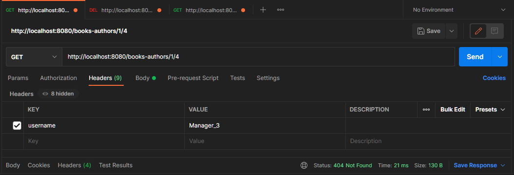

## Java/Spring/PostgreSQL/RabbitMQ/MongoDB) ##

#### Реализовано 2 микросервиса:

* **rest_books_server** - ответственный за создание Авторов и Книг (отношение авторов и книг - многие-ко-многим), также при запросе на любой ендпойнт REST серверао, в RabbitMQ отправляется ивент с информацией о том Кто, Когда, какое Действие выполнил (Кто указывается в заголовке запроса в поле username)
* **rabbitmq_mongo_server** - вычитывет ивенты из RabbitMQ и сохраняет их в MongoDB

**Инициализация:**
*PostgreSQL:*
* Создать БД: rest_books
* Создать пользователя: rest_books (пароль: rest_books)

*RabbitMQ:*
* Добавить Exchange: rest-book-exchange
* Добавить Queue: rest-book-queue
* Связать Queue c Exchange, routingKey: rest-book-routingkey

*MongoDB:*
* Создать БД: rest-book

**Примечания:**

*rest_books_server:*
* Используется iBatis для исполнения запросов в БД
* Используется БД PostgreSQL
* Структура таблиц создается самим сервисом при старте (используется Flyway), SQL скрипты расположены по пути rest_books_server\src\main\resources\db\migration
* при запросе на любой ендпойнт в RabbitMQ отправляется ивент, которые собираются вторым микросервисом и записываются в MongoDB:


**Структуры объектов**
```
Book {  
	id			long
	name		string
	published	string
	authors		List<Author>
	params		string
}

Author {
	id			long
	firstName	string
	lastName	string
	birthDate	date
	age			string
	sex			string
	books		List<Book>
}

Event {
	username	string
	actionDt	date-time
	method		string
	endpoint	string
	params		string
}
```

-----------------------------------

**Используемые API**

*Все ендпойнты REST API в заголовке запроса принимаю информацию username (необязательно)*

*Для работы с книгами:*
* GET /book - возвращает список всех книг. Статусы: OK, NOT_FOUND
* GET /book/{id} - возвращает книгу по id. Статусы: OK, NOT_FOUND
* POST /book - добавление новой книги, в теле запроса принимается объект Book. Статусы: OK, BAD_REQUEST
* PUT /book/{id} - обновляет данные книги по id, в теле запроса принимается объект Book. Статусы: OK, NOT_FOUND
* DELETE /book/{id} - удалает книгу по id. Статусы: OK, NOT_FOUND

*Для работы с авторами:*
* GET /author - возвращает список всех авторов. Статусы: OK, NOT_FOUND
* GET /author/{id} - возвращает автора по id. Статусы: OK, NOT_FOUND
* POST /author - добавление нового автора, в теле запроса принимается объект Author. Статусы: OK, BAD_REQUEST
* PUT /author/{id} - обновляет данные автора по id, в теле запроса принимается объект Author. Статусы: OK, NOT_FOUND
* DELETE /author/{id} - удалает автора по id. Статусы: OK, NOT_FOUND

*Для работы со связыванием Книг с Авторами:*
* GET /books-authors/{bookId}/{authorId} - проверяет связь Книги (по bookId) с Автором (по authorId). Статусы: OK, NOT_FOUND
* POST /books-authors/{bookId}/{authorId} - добавляет связь Книги (по bookId) с Автором (по authorId). Статусы: OK, NOT_FOUND
* DELETE /books-authors/{bookId}/{authorId} - удалает связь Книги (по bookId) с Автором (по authorId). Статусы: OK, NOT_FOUND

-----------------------------------

**Настройки проекта rest_books_server**

Файл application.properties
```
# server
server.port=8080
# logging
logging.level.root=info
# flyway
spring.flyway.url=jdbc:postgresql://localhost:5432/rest_books
spring.flyway.user=rest_books
spring.flyway.password=rest_books
# rabbitmq
spring.rabbitmq.host: localhost
spring.rabbitmq.password: guest
spring.rabbitmq.port: 5672
spring.rabbitmq.username: guest
spring.rabbitmq.exchange: rest-book-exchange
spring.rabbitmq.queue: rest-book-queue
spring.rabbitmq.routingkey: rest-book-routingkey
```

**Настройки проекта rabbitmq_mongo_server**

Файл application.properties
```
# server
server.port = 8081
# rabbitmq
spring.rabbitmq.host = localhost
spring.rabbitmq.port = 5672
spring.rabbitmq.username = guest
spring.rabbitmq.password = guest
spring.rabbitmq.exchange = rest-book-exchange
spring.rabbitmq.queue = rest-book-queue
spring.rabbitmq.routingkey = rest-book-routingkey
# mongodb
spring.data.mongodb.host = localhost
spring.data.mongodb.port = 27017
spring.data.mongodb.database = rest-book
```

-----------------------------------

**Структура проекта rest_books_server**

 


**Структура проекта rabbitmq_mongo_server**

 


**Скриншоты работы**

При старте структура БД создается автоматический, используется Flyway

 

 

 


Пример указания в заголовке запроса информации username:

 


Примеры работы с Книгами:

 

 

 

 


Аналогичным спсособом происходит работа с Авторами ...


Примеры работы со связями Книга - Автор:

 

 

 

 


Работа приложения rest_books_server в консоли, пример отправки событии в RabbitMQ:

 


Работа приложения rabbitmq_mongo_server в консоли, пример приема событии из RabbitMQ и запись в MongoDB:

 


Скриншот обозревателя MongoDB Compas, пример записи событии в MongoDB:

 